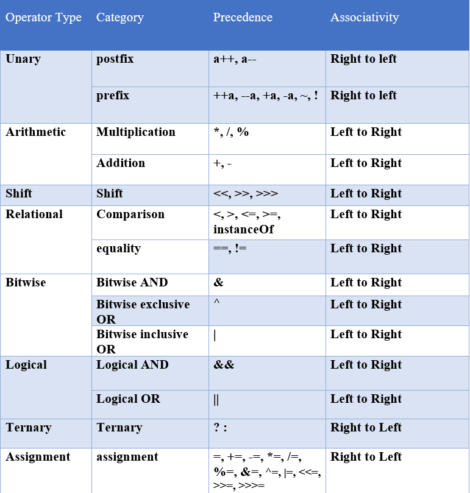

# **`Number System`**

Note: We can only create one public class in a file and the class name should be same as file name. 

## **Assignment Operator**

Assigns the right-hand operand's value to the left-hand operand.  

## **Arithmetic Operators**

| Operators |   Meaning |
| --------- |   ------- |
|   +   |   Addition    |
|   -   |   Subtraction |
|   *   |   Multiplication  |
|   /   |   Division    |
|   %   |   Modulus Operator to get remainder in integer division   |

## **Order of Operation**

|   Title   | Meaning     |
|   -----   |-------------|
|   B       | Bracket     |
|    O      | Order       |
|   D       | Division    |
|   M       | Multiply    |
|   A       | Addition    |
|   S       | Subtraction |


| Title | Meaning     |
|-------|-------------|
| P     | Parentheses |
| E     | Exponents   |
| M     | Multiply    |
| D     | Division    |
| A     | Addition    |
| S     | Subtraction |

In case of _same precedence_ we'll start from left to right. 

## **Shorthand Operator**

|   Operator Symbol |   Name of the operator    |
|   --------------- |   --------------------    |
|   +=              |   Addition Assignment     |
|   -=              |   Subtraction Assignment  |
|   *=              |   Multiplication Assignment|
|   /=              |   Division Assignment     |
|   %=              |   Remainder Assignment    |

## **Unary Operator**

|   Operator    |   Description |   Example |
|   -------     |   ----------- |   ------- |
|   -           |   Convert a positive value to a negative  |   x = -y  |
|   Pre Increment   |   Increment the value by 1 and then use it in our statement   |   x = ++y |
|   Pre Decrement   |   Decrement the value by 1 and then use it in our statement   |   x = --y |
|   Post Increment  |   Use current value in the statement and then increment it by 1   |   x = y++ |
|   Post Decrement  |   Use current value in the statement and then decrement it by 1   |   x = y-- |

## **if-else Statement**

This is important because our program runs based on a certain conditions. If the conditions match then the program will continue otherwise the program get exited. 

```java
import java.lang.*;
import java.util.Scanner;

public class NumberSystem {
    public static void main(String[] args) {
        boolean isLoggedIn = true;
        if(isLoggedIn){
            // do this
        }else {
            // do that
        }
    }
}
```

We can also nest our conditions. Curly braces can be ommitted for single statements, but not recommended.

## **Relational Operators**

- First Operand
  - Relation (For a single condition)   ->  Boolean
- Second Operand

|   Operator    | Description                      |
|   --------    |----------------------------------|
|   ==          | Checks value equality            |
|   ===         | Checks value and type equality   |
|   !=          | Checks value ineqality           |
|   !==         | Checks value and type inequality |
|   >           | Greater than                     |
|   <           | Less than                        |
|   >=          | Greater than or equal to         |
|   <=          | Less than or equal to            |

Operator precedence of _Relational Operators_ is lesser than _Arithmetic Operators._

## **Logical Operators**

- First Operand
- Second Operand
  - Relation | Logical  (For multiple conditions)   -> Boolean
- Third Operand
- Forth Operand

|   Operator    |   Description |
|   --------    |   ----------- |
|   && (AND)    |   All conditions must be true for the result to be true   |
|   ||  (OR)    |   Only one condition must be true for the result to be true   |
|   !   (NOT)   |   Inverth the boolean value of a condition    |

_Logical Operators_ has lower priority than _Match & Comparison_ operators.

## **Operator Precedence**



When it comes to execution of a program which has multiple operators in their expression then there are two ways to find-out the final result of the expression, with the help of :- 

1. **Operator Precedence** : When there are multiple operators which has different-different weightage then this conversion is used to solve the expression. 
2. **Associativity** : If there are multiple operators with the same _precedence order_, then the _associativity law_ will be used to solve the expression. Which simply determines the direction of execution. 

## **Bitwise Operators**

| Operators          | Description |
|--------------------| ----------- |
| & (AND)            | Each bit of the output is 1 if the corresponding bits of both operands are 1, otherwise 0 |
| \ (OR)             | Each bit of the output is 0 if the corresponding bits of both operands are 0, otherwise 1 |
| ^ (XOR)            | Each bit of the output is 1 if the corresponding bits of both operands are different  |
| ~ (NOT)            | Performs a bitwise complement. It inverts the bits of its operand (1 -> 0; 0 -> 1)  |
| << (LEFT SHIFT)    | Shifts all operand's bit to the left by the number of position specified by the right operand, filling the righmost bits with zeros as padding. |
| '>>' (RIGHT SHIFT) | Shifts all operand's bit to the right. If the left operand is positive, zero are filled into the new leftmost bits; if negative, ones are filled in. |